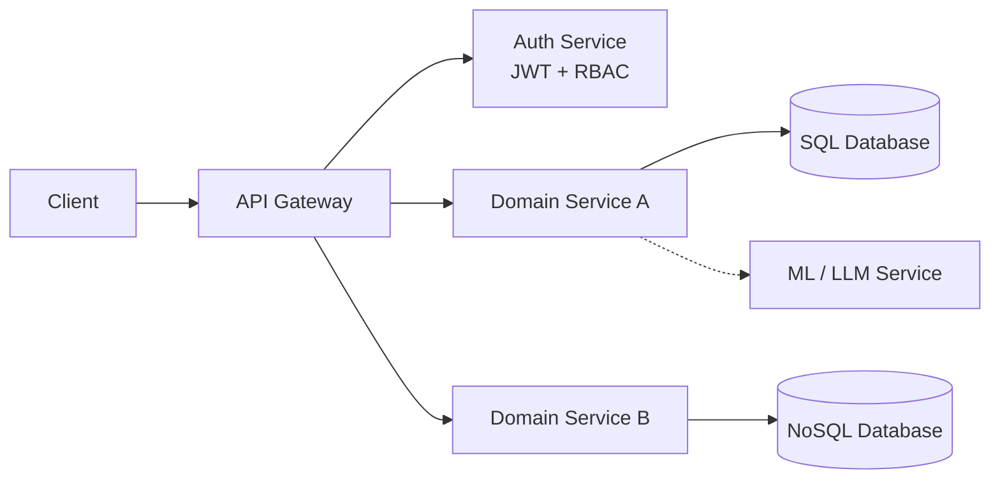

<!--
  SETUP CHECKLIST (this comment is invisible on GitHub)
  1. Replace YOUR-HANDLE, YOUR_EMAIL and YOUR_RESUME_LINK in the contact badges.
  2. Fill in the 3 project cards below (search this file for "TODO").
  3. Optional: uncomment the LeetCode card near the bottom and add your username.
  4. The repo must be public and named exactly kamalnath22/kamalnath22 to show on your profile.
-->

 

 

## About

I build backend systems that stay correct under pressure: concurrent writes, untrusted input, and services that have to talk to each other reliably. My focus is **Java, Spring Boot and microservices**, with secure REST APIs, JWT authentication and role-based access control as the foundation.

I also integrate **machine learning models and LLM APIs** into backend pipelines, so intelligent features sit on top of solid infrastructure instead of being bolted on.

|  |  |
|:--|:--|
| **Education** | B.Tech Computer Science (3rd year), SRM Institute of Science and Technology, Chennai |
| **CGPA** | 9.77 / 10 |
| **Focus** | Backend engineering, microservices, API security, system design |
| **Practice** | Data structures and algorithms on LeetCode |
| **Status** | Open to SDE / Backend internships and full-time opportunities |

 

## What I Bring

<table>
<tr>
<td width="50%" valign="top">

**Scalable API Design** 
RESTful services in Spring Boot with clean layered architecture and clear service boundaries.

</td>
<td width="50%" valign="top">

**Security First** 
JWT-based authentication and role-based access control with Spring Security.

</td>
</tr>
<tr>
<td width="50%" valign="top">

**Reliability** 
Concurrency handling and data integrity so state stays consistent when requests overlap.

</td>
<td width="50%" valign="top">

**Intelligent Systems** 
ML models and LLM APIs wired into production-style backend pipelines, including fraud detection.

</td>
</tr>
</table>

 

## Tech Stack

<table>
<tr>
<td align="left"><b>Languages</b></td>
<td align="left">
 
Java (primary) · Python · C / C++ · SQL · JavaScript
</td>
</tr>
<tr>
<td align="left"><b>Backend</b></td>
<td align="left">
 
Spring Boot · Spring Security · FastAPI · React
</td>
</tr>
<tr>
<td align="left"><b>Databases</b></td>
<td align="left">
 
MySQL · PostgreSQL · MongoDB
</td>
</tr>
<tr>
<td align="left"><b>ML</b></td>
<td align="left">
 
scikit-learn · Pandas · NumPy · LLM API integration
</td>
</tr>
<tr>
<td align="left"><b>Tools</b></td>
<td align="left">
 
Git · GitHub · Docker · Postman · IntelliJ IDEA · VS Code
</td>
</tr>
</table>

 

## Featured Projects

<!-- TODO: Replace each card with a real project. Recruiters scan for numbers, so include at least one measurable result per project. -->

### 1. [Project Name](https://github.com/kamalnath22/REPO-NAME) · Fraud Detection Service

*[One sentence: what problem it solves and who it is for.]*

- **Stack:** Java, Spring Boot, [database], [ML library], Docker
- **Engineering highlights:** [e.g., real-time transaction scoring, idempotent APIs, concurrency control, rule engine plus ML model]
- **Impact:** [e.g., handles X concurrent requests, p95 latency under Y ms, Z% detection accuracy]

### 2. [Project Name](https://github.com/kamalnath22/REPO-NAME) · Microservices Platform with Secure Auth

*[One sentence: what the platform does.]*

- **Stack:** Java, Spring Boot, Spring Security, [database], Docker
- **Engineering highlights:** [e.g., JWT auth, RBAC across N services, API gateway, inter-service communication]
- **Impact:** [e.g., N services, N roles and permissions, X% test coverage]

### 3. [Project Name](https://github.com/kamalnath22/REPO-NAME) · ML / LLM Integrated Pipeline

*[One sentence: what the pipeline does end to end.]*

- **Stack:** Python, FastAPI, scikit-learn, [LLM API], [database]
- **Engineering highlights:** [e.g., model serving behind a REST API, prompt and response handling, retries and timeouts]
- **Impact:** [e.g., inference latency, accuracy or quality metric]

 

## How I Design Systems

A reference architecture I typically work with:

**Principles I follow:**

- Validate at the boundary, authorize on every request.
- Make writes safe to retry and safe under concurrency.
- Keep services small, independently deployable and easy to test.
- Measure before optimizing.

 

## GitHub Stats

 

<!--
  OPTIONAL: LeetCode card. Replace YOUR-HANDLE, then remove this comment wrapper.

-->

 

## Let's Connect

I'm looking for backend and SDE roles where I can own APIs, work on reliability and security, and keep learning from strong engineers. If that sounds like your team, reach out through [LinkedIn](https://www.linkedin.com/in/YOUR-HANDLE) or [email](mailto:YOUR_EMAIL).

